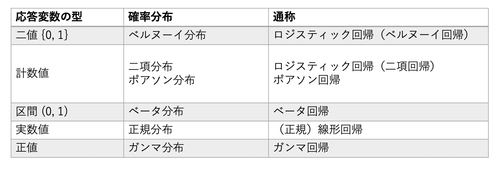
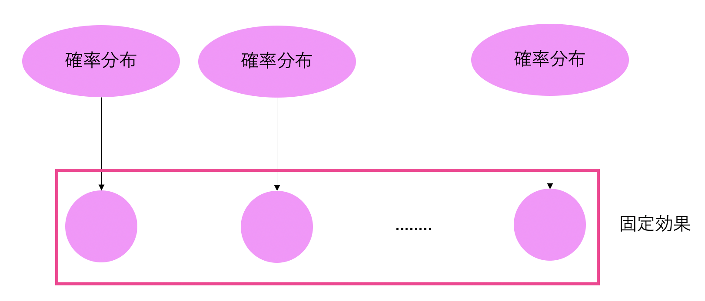
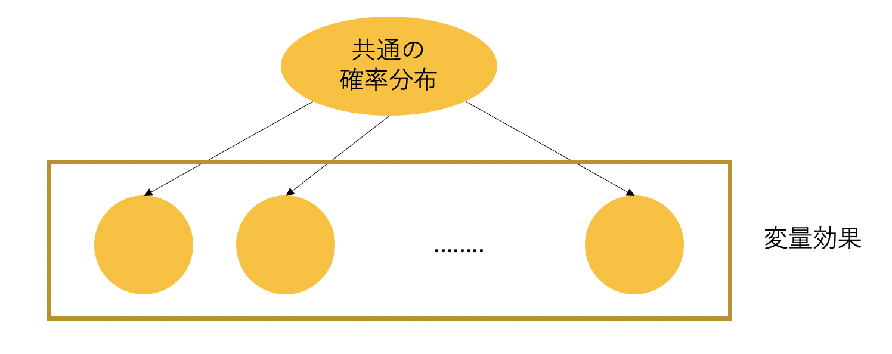
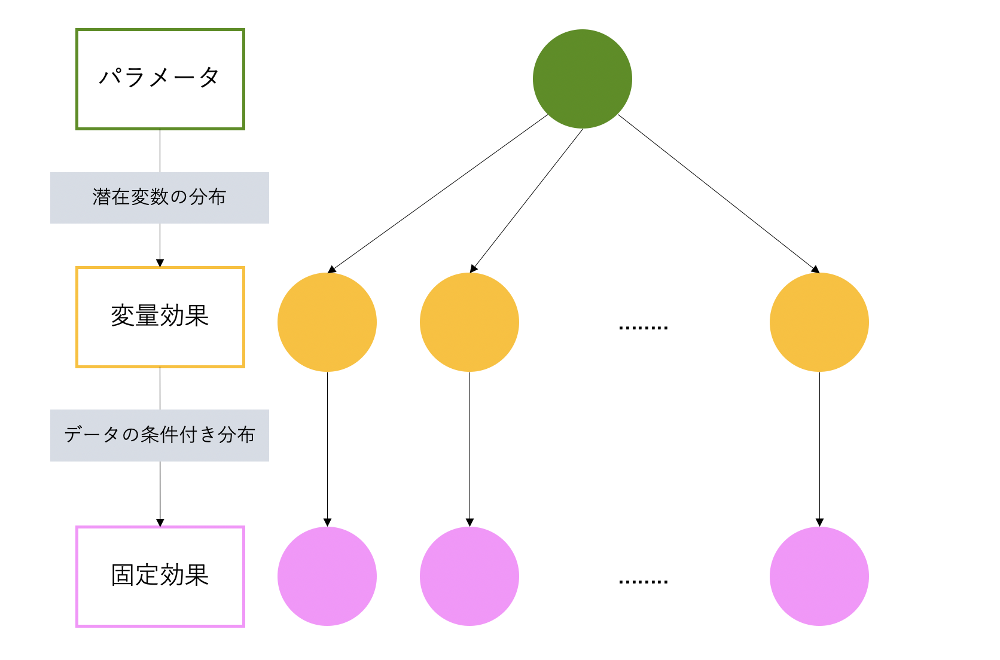

## 統計数理研究所リーディングDAT養成講座L-B1コース Day1

20.12.17

## はじめに
#### タイトル
- 統計モデリングの基礎と応用　ー線形モデルから階層ベイズへー
#### 内容について
- 範囲：統計モデルの導入に始まり、階層モデルへの拡張まで
- 基本的な枠組みの説明＋解析例
  - 理論的説明の深堀りはあまりしていない印象（上記範囲の大枠を把握できる程度）
- 生態系のフィールドの講師で、解析例も生物に関するテーマが多め

## このドキュメントについて
#### 構成
- 講義内容をもとに、次の内容についてまとめる
  - Part1. 統計モデルの概要を要約
  - Part2. 応用的解析例の紹介

---
# Part1.統計モデルの概要を要約

---
## 0. イントロダクション

#### 統計モデリングとは

- 現実のデータ生成過程を近似する確率（統計）モデルに基づいて、現象の理解、予測、
意思決定につなげるプロセス

#### 統計モデルの実用上の利点
- 大部分の統計的手法の背景に統計モデルがあるので、様々なデータ解析手法を統一的に
理解、応用できる
- 目的や状況に即した柔軟なデータ解析が可能となる

#### 統計モデルの基本的な構造
- 単回帰モデルを例に

$$y_i = a + bx_i + e_i$$

$\qquad a$：切片
$\qquad b$：回帰係数
$\qquad e_i$：残差

- 応答変数 $y$ の変動を、以下の2つに大別される成分に分解して説明することができる
  - 系統的（決定的）成分
    - 応答変数の変動のうち、規則的な部分
    - 共変量などの関数として記述できる
    - 回帰関数、リンク関数、固定効果 $etc$
  - 確率的成分
    - 応答変数の変動のうち、不規則な部分
    - 確率分布によって記述できる
    - データの確率分布、変量効果の確率分布 $etc$

#### 統計モデルの階層的分類

#### 統計モデルに基づく推測

- 予測のアプローチ
  - 最尤推測：パラメータの最尤推定値を用いる
  - ベイズ推測：パラメータの事後分布を用いる

---
## 1. 確率変数と確率分布

#### 確率変数とは
- 不規則な変動に従う、あるいは母集団の要素から無作為に標本抽出される変数
- 統計モデルでは、基本的にデータを確率変数とみなす

#### 確率分布とは
- 確率変数の取りうる値と、それぞれの値の現れやすさに関する数学的記述
- 確率密度関数あるいは確率関数によって表される

#### 統計モデリングのプロセスは...
- データから得られる経験分布を適切に表現できる理論分布（確率分布）
を特定する

#### 確率分布を特徴付ける量
- 代表値
  - 平均値
  - 中央値
  - 最頻値
- ばらつき
  - 分散
  - 標準偏差
  - 四分位範囲

---
## 2. 統計モデルの当てはめと予測
#### ここで考える確率分布
- ポアソン分布：
$\qquad　\qquad　\qquad Poisson(x | \lambda) = \frac{\lambda ^x e^{-\lambda}}{x!}$

$\qquad　\qquad　\qquad　\qquad　\qquad　\quad \lambda$：ポアソン分布の形を決めるパラメータ

#### 最尤推定
- モデルの**尤度を最大化**するパラメータの値を推定値とする推測様式
- 尤度：
  - 統計モデルのもとでのデータの同時確率（密度）を、
  パラメータの関数としてみたもの

$\qquad \qquad \qquad \qquad \qquad L(\theta | y) = p(y | \theta)$

$\qquad \qquad \qquad \qquad　\qquad \qquad \qquad　\qquad \qquad　y$：データ
$\qquad \qquad \qquad \qquad　\qquad \qquad \qquad　\qquad \qquad　\theta$：パラメータ

- 対数尤度：
  - 尤度関数は、特定のパラメータでのデータの同時確率で算出される
  - そのため、値が小さくなりやすく、そのままでは扱いにくい
  - そこで、尤度関数の対数をとった対数尤度を推定量とする
- 最尤推定値：
  - 尤度関数を最大にするパラメータの値として定式化される
$\qquad \qquad \qquad \quad  \hat{\theta} = \argmax l(\theta | y)$

#### 当てはめ
- 今回扱うポアソン分布による尤度関数は次の通り定義できる
$\qquad \qquad \qquad \qquad \qquad L(\lambda | y) = p(y | \lambda)=\prod_{i=1}^N Poisson(y_i|\lambda)$
- 最尤推定値は、
$\qquad \qquad \qquad \qquad \qquad \hat{\lambda} = \argmax l(\lambda | y)$

#### 推定の不確実性を評価する
- パラメータの最尤推定値による尤度関数をもとに、予測分布が求められる
- 次に、この予測分布から元の標本と同じ大きさの標本を反復抽出（**パラメトリックブートストラップ**）して、複数のパラメータ推定値を求め、推定値のばらつきを評価する（＝現在の予測分布を規定しているパラメータは、妥当な値であるかの評価）

#### モデルの当てはまりを評価する
- ここでは、当てはめたモデルがデータの変動を適切に表せているかどうかを評価する
- 評価指標（適合度指標）はいろいろあるが、今回は**残差逸脱度**を導入する
- 残差逸脱度：
$\qquad \qquad \qquad \qquad  D^\ast (y;\hat{\theta}) = 2logL(\theta ^\ast | y) - 2logL(\hat{\theta} | y)$
  - 完全モデル（データの値自体を期待値としたモデル）の対数尤度と、当てはめたモデルの対数尤度の差分
  - 値が小さいほど当てはまりが良い
  - モデルが完全にデータを説明できている場合には、$D^\ast(y;\hat{\theta})=0$
  - 正規分布モデルの場合：
  $\qquad \qquad \qquad D^\ast(y;\hat{\theta})=\sum_i\frac{(y_i-\hat{\mu_i})^2}{\sigma^2}$
    - これはつまり、残差平方和の一般化となっている
- 残差逸脱度の不確実性を評価する
  - 当てはめたモデルがデータの変動を適切に表せているならば、モデルの逸脱度は標本ので型による逸脱どの変動の範囲内にあるはず...
  - パラメトリックブートストラップを行い抽出された標本にモデルを当てはめ、それぞれの残差逸脱度を計算
  - 得られた残差逸脱度の分布をもとに、予測分布を生成したモデルの逸脱度を評価する

---
## 3. モデル選択
- **モデルの良さ**って何で決まる？
  - 当てはまりの良いモデル＝良いモデルとは限らない
    - オーバーフィッティングにより、予測精度が下がることがある
  - 従って、**予測に耐えうる適度な当てはまりのモデル**を選択することが重要である
- モデル選択の指針
  - 新しいデータに対して良い予測を与えるモデルを選ぶ
- なぜオーバーフィッティングが起こるのか
  - 予測精度は、モデル当てはめに用いたデータと新しいデータで意味合いが変わる
    - 訓練誤差
      - モデルを当てはめたデータに対する予測の悪さ
      - モデルの当てはまりの良さと同じ
      - モデルを複雑にするほど訓練誤差は減少するが、オーバーフィッティングが起こり予測精度は悪くなる
    - 汎化誤差
      - 新しいデータに対する予測の悪さ
      - モデルを複雑にしすぎると汎化誤差はかえって悪くなる
  - すなわち、汎化誤差が小さいモデルを選ぶことで、オーバーフィッティングを防いで予測精度の良いモデルを選択することができる
- 予測精度を評価する
  - 最尤推測の下でのモデル選択：
    - AIC: $-2logp(y|\hat{\theta}) + 2k$
    - モデルの最大対数尤度とモデルのパラメータ数の和
  - ベイズ推測の下でのモデル選択
    - WAIC: $-2\sum_{i=1}^NlogE_{post}[p(y_i|\theta)] + 2\sum_{i=1}^N Var_{post}[logp(y_i|\theta)]$

$\qquad \qquad \qquad \qquad \qquad \qquad \qquad \qquad E_{post}[p(y_i|\theta)]$：観測 $i$ の尤度の事後平均
$\qquad \qquad \qquad \qquad \qquad \qquad Var_{post}[logp(y_i|\theta)]$：観測 $i$ の対数尤度の事後分散

- 評価のプロセス
  - データを分割して、当てはめと予測精度の評価を繰り返す（**交差検証**）
    - 一つ抜き交差検証（leave-one-out）
      - 1つの観測値を予測誤差の評価に用いる
    - k分割交差検証（k-fold）
      - Kグループに分割された観測値の1グループを予測ごさの評価に用いる

---
## 4. 正規線形モデル
- 共変量 $x$ によって表現できそうな $y$ がある時、回帰関数を用いて 
$y$ の**条件付き期待値**（$x$ を所与としたときの $y$ の期待値）をモデル化できる

- 回帰関数とは
  - 確率分布の条件付き期待値（あるいは分布のパラメータ）の系統的な変化を
  表す共変量の関数

- 正規線形モデル
  - 線形な回帰関数（※）と正規分布誤差によって、
  応答変数の変動を表現するモデル
※ 係数と共変量の積和の形で表される回帰関数のことであり、回帰線が直線になることではない
$\qquad \qquad \qquad y_i = \mu(x_i)+e_i$
$\qquad \qquad \qquad \mu(x_i) = \beta_0 + \beta_1x_{1i} + ...$
$\qquad \qquad \qquad e_i \thicksim N(0, \sigma^2)$

- 当てはめたモデルに対して、パラメータの推定値の評価、モデルの当てはまりの評価、モデル選択などの手続きを取り、モデリングをする

---
## 5. 一般化線形モデル（GLM）

- 一般化線形モデル（以降GLM）とは
  - 正規線形モデルの確率的成分を、指数型分布族まで拡張したもの

- リンク関数
  - GLMで扱われるデータは、その型によって**取りうる値の範囲が異なる**
  - 従って、リンク関数を用いて回帰関数を適切な範囲に収める必要がある
- リンク変換
$\qquad \qquad \qquad g(\mu) = \eta = \beta_0 + \sum_{j=1}^p\beta_jx_j$

$\qquad \qquad \qquad \qquad \qquad \qquad  g$：条件付き期待値を $(-\infty, \infty)$ に写像するリンク関数
$\qquad \qquad \qquad \qquad \qquad \qquad  \mu$：確率分布の条件付き期待値
$\qquad \qquad \qquad \qquad \qquad \qquad  \eta$：線形予測子
- 逆リンク変換
$\qquad \qquad \qquad　\mu = g^{-1}(\eta) = g^{-1}(\beta_0+\sum_{j=1}^p\beta_jx_j)$

$\qquad \qquad \qquad \qquad \qquad \qquad  g^{-1}$：線形予測子を条件付き期待値の尺度に変換する逆リンク関数

- リンク関数の絡み方
  - 恒等リンク（正規線形回帰）
    - リンク変換：　$\mu = \eta$
    - 逆リンク変換：　$\mu = \eta$
  - 対数リンク（ポアソン回帰）
    - リンク変換：　$log\mu = \eta$
    - 逆リンク変換：　$\mu = exp(\eta)$
  - ロジットリンク（ロジスティック回帰）
    - リンク変換：　$log\frac{\mu}{1-\mu} = \eta$
    - 逆リンク変換：　$\mu = \frac{exp(\eta)}{1+exp(\eta)}$

- GLMは、リンク変換、逆リンク変換により回帰関数の取りうる値の範囲を調節した後、モデル当てはめ、パラメータの推定値の評価、モデルの当てはまりの評価、モデル選択などの手続きを取り、モデリングをする

---

## 6. 一般化線形混合モデル（GLMM）

- 一般化線形混合モデル（以降GLMM）とは
  - GLMに**変量効果**が追加されたモデル

- 変量効果と固定効果
  - 固定効果
    - 個々の独立した確率分布から生成される効果

  - 変量効果（ランダム効果ともいう）
    - 共通の確率分布から生成される効果

- 変量効果の利点
  - 説得力の借用による精読場を見込める
  - 変量効果の母集団まで推測を一般化できる
  - 確率分布を柔軟に拡張できる
  - データの相関構造を説明できる
  - 分散成分を分解できる
  - 観測されていない潜在変数を推測できる（→階層モデリング）

- GLMMの構造

- 過大分散の説明
  - ポアソン分布や二項分布は、**期待値の値と連動して分散も決まってしまう**
  - そのため、分散のスケールを個別に調節することができず、モデル当てはめにより得られた理論分布でうまく表現できない場合がある（データのばらつきが異常に大きくなる＝過大分散）
  - こうした場合に、変量効果を導入することで、分散成分を個別に説明することができ、当てはまりを良くすることができる

---

## 7. ベイズ推測
- ベイズ推測とは
  - **事後分布**に基づく統計推測
- 最尤推測との違い
  - 最尤推測：
    - 尤度に基づき、データを最も良く説明するパラメータを特定
    - パラメータは点推定値として与えられる
  - ベイズ推測：
    - 所与の情報のもとでのパラメータの不確実性を確率分布で表現
    - パラメータは事後分布として与えられる
- なぜベイズ推測を用いるのか
  - 事後分布には、点推定値にない統計的利点がある
    - 不確実性を十分に考慮した推測、予測
    - モデルのオーバーフィッティングの抑制
  - MCMCによりモデル化の幅が広がる
- ベイズ推測概観

  - ベイズモデル＝
  データの確率分布モデル＋モデルパラメータの確率分布モデル
  - 最尤推測ではデータの確率分布モデル（統計モデル）にフォーカスされていたが、ベイズ推測ではパラメータの確率分布モデル（事前/事後分布）も推測の対象となっている
- ベイズの定理
  - $B$ を所与とした時の $A$ の確率を表す
  - 事前確率 $\Pr(B)$ が与えられ、それをもとに事後確率 $\Pr(B|A)$を算出する
$$\begin{aligned}
    \Pr(B|A) &= \frac{\Pr(A|B)\Pr(B)}{\Pr(A)} \\
    &= \frac{\Pr(A|B)\Pr(B)}{\Pr(A|B)\Pr(B)+\Pr(A|not B)\Pr(not B)}
\end{aligned}$$
- ベイズの定理をパラメータ推定に導入し、事後分布を得る
  - データ $y$ 所与のもとで、事後分布はモデル（尤度）と事前分布の2つによって定まる
  - 事後分布は、尤度を重みとして事前分布を修正したものと見ることができる
$$p(\theta|y) = \frac{p(y|\theta) p(\theta)}{p(y)} = \frac{p(y|\theta)p(\theta)}{\int p(y|\theta)p(\theta)d\theta}\varpropto p(y|\theta)p(\theta)$$

$\qquad \qquad \qquad \qquad \qquad \qquad \qquad \quad p(y|\theta)$：統計モデル（尤度関数）
$\qquad \qquad \qquad \qquad \qquad \qquad \qquad \quad p(\theta)$：事前分布
$\qquad \qquad \qquad \qquad \qquad \qquad \qquad \quad \int p(y|\theta)p(\theta)d\theta$：規格化定数

- MCMC
  - ベイズ推測において、規格化定数を評価するのが困難なため、解析的にパラメータを推定するのは困難である
  - そこで、関数 $f(x)$ に比例する $p(x)=\frac{f(x)}{\int f(x) dx}$ に従う乱数を**MCMC**によって逐次生成する
  - MCMCでは、直前のパラメータの値を所与とした条件付き確率に基づいて乱数を生成するため、目標の分布に収束するようになる
  - MCMCの枠組みと、ベイズ推測における事後分布の枠組みを比較すると...
    - 事後分布：
$\qquad \qquad p(\theta|y) = \frac{p(y|\theta)p(\theta)}{\int p(y|\theta)p(\theta)d\theta}\varpropto p(y|\theta)p(\theta)$
    - MCMC：
$\qquad \quad p(x) = \frac{f(x)}{\int f(x) d\theta}\varpropto f(x)$に従う乱数 $x$ を標本抽出
  - つまり、 $f(\theta) = p(y|\theta)p(\theta)$ と置くことで、MCMCで事後分布に従う乱数を生成できる（積分の計算を省略できる）

- ここまでをまとめるとこんな感じ

- ベイズモデルにおける予測（事後予測分布）
  - 事後予測分布は、事後分布に関して予測値 $y^\ast$ に対する統計モデル（予測分布）の平均をとることで、パラメータの不確実性を織り込んだ予測分布として導出できる
  - 事後予測分布は、モンテカルロ積分の枠組みで数値近似することができる

$$\begin{aligned}
    p(y^\ast|y) &= \int p(y^\ast|\theta)p(\theta|y)d\theta \\
    &\thickapprox \frac{1}{M} \sum_{m=1}^Mp(y^\ast|\theta_m)
\end{aligned}$$
$\qquad \qquad \qquad \qquad \qquad \qquad \theta_m \thicksim p(\theta_m|y)$

---
## 8. 階層モデル
- 階層モデル
  - 条件付き部分モデルを組み合わせて階層的に構造化された統計モデル
  - GLMMは階層モデルの一例
- 階層モデルとして定義されるモデルの一覧（一部）
  - マルチレベルモデル
    - 階層構造を持つデータのモデル化
  - 湯原混合モデル
    - 離散潜在変数を用いた確率分布の拡張
  - 無限混合モデル
    - 連続潜在変数を用いた確率分布の拡張
  - 隠れマルコフモデル
    - 離散潜在変数を用いた時系列データのモデル化
  - 状態空間モデル
    - 連続潜在変数を用いた時系列データのモデル化
  - 空間モデル
    - 確率場を用いた空間データのモデル化
- 階層モデルの推測
  - 主な推定対象はパラメータ $\theta$ と潜在変数 $x$ 
  - アプローチは次の2つがある
    - 経験ベイズ： 
      - 最尤法によるパラメータの点推定＋潜在変数のMAP推定の2段階推測
    - 完全ベイズ：
      - パラメータと潜在変数の同時事後分布 $p(x, \theta|y)$ を推測

| 経験ベイズ | 経験ベイズ | 完全ベイズ |
| -------- | ---------| -------- |
|パラメータの推定 | $\hat{\theta}=\argmax\limits_\theta p(y\vert\theta)$ | $p(\theta\vert y) = \int p(x,\theta \vert y)dx$ |
| 潜在変数の推定 | $\hat{x} = \argmax\limits_x p(y, x \vert \hat{\theta})$ | $p(x \vert y) = \int p(x, \theta \vert y)d\theta$ |
| パラメータの事前分布 | 一様事前分布（明示的に指定しない） | 明示的に指定 | 

---
# Part2. 応用的解析例の紹介

---
#### 検出誤差の問題に適応した解析
- 偽陰性の問題
  - 分布やデータ数など、状態変数の過小評価につながる
  - 動態パラメータ（移入率など）の推定バイアスを引き起こす
  - 外来変数（環境条件など）と分布、データ数の関係において誤った評価をしてしまう
- 検出誤差を踏まえた推測
  - サイト占有モデル
    - 検出、非検出データから対象の有無を推定
    - データ生成過程を以下のようにモデル化
      - 観測モデル：サイトの占有、非占有の状態に応じた検出確率のモデル
        - $y_{ij} \thicksim Bernoulli(pz_i)$
      - 過程モデル：サイト占有の確率モデル
        - $z_i \thicksim Bernoulli(\psi)$
    - 2つのベルヌーイ分布の組み合わせによって反復検出データを説明
  - N混合モデル
    - 観測計数データから観測数を推定
    - データ生成過程を以下のようにモデル化
      - 観測モデル：各観測値が独立に、確率 $p$ で検出される（偽陽性なしと仮定）
        - $n_{ij}\thicksim Binominal(p, N_i)$
      - 過程モデル：サイトの観測数についての確率分布モデル
        - $N_i \thicksim Poisson(\lambda)$ 
    - ポアソン分布と二項分布の組み合わせによって反復計数データを説明
